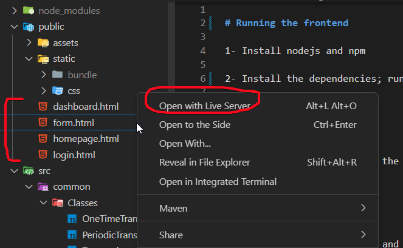

# Running the frontend

1- Install nodejs and npm

2- Install the dependencies; run the following command:

```
npm install
```

To compile the project, run the following command:

```
npm build
```

Now the project is compiled and ready to be served. To serve the project, install Live Server extension in Visual Studio Code and run the HTML files.

